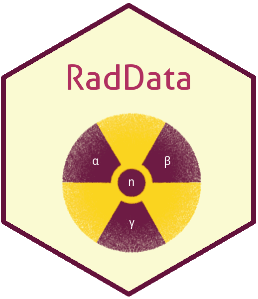

<!-- README.md is generated from README.Rmd. Please edit that file -->

```{r setup, include = FALSE}
knitr::opts_chunk$set(
  collapse = TRUE,
  comment = "#>",
  fig.path = "man/figures/README-",
  out.width = "100%"
)
```
# RadData 

This package contains data from the International Commission on Radiological Protection (ICRP) Publication 107, Nuclear Decay Data for Dosimetric Calculations. The data sets were converted from the original to a tidy data set. The files include:

* ICRP-07.NDX The index file has 32 variables, including 31 original variables from ICRP. The 32nd variable is a derived decay_constant variable in inverse seconds, to allow activity computation without unit conversion issues.

* ICRP-07.RAD Data on the energy and yield of each radiation emitted in nuclear transformations of the radionuclide.

* rad_codes A small table providing descriptions of the codes used in ICRP-07.RAD.

* ICRP-07.BET Beta decay spectra for beta emitters.

## Installation

You can install the released version of RadData from [CRAN](https://CRAN.R-project.org) (after it has been released) with:

``` r
install.packages("RadData")
```
The development version from GitHub:
 
```{r eval = FALSE}
# install.packages("devtools")
devtools::install_github("markhogue/RadData")
```

## Overview
To start using the installed package: 

```{r}
library(RadData)
```

Functions for selecting and filtering data for health physics computations will be included in the package ```radsafer```.

## Source Data 

Source data is from ICRP 107 copyright 2008 Eckerman and Endo. This data is provided with the following text in the license.txt file:

ICRP-07 Data Files Copyright Notice

Copyright (C) 2008 A. Endo and K.F. Eckerman, Authors.  All Rights Reserved.

Permission is hereby granted to any person obtaining a copies of the ICRP-07
data files and associated documentation to use, copy, and distribute these
materials and the documentation for educational, research, and not-for-profit
purposes, without fee and without a signed licensing agreement provided that
the file LICENSE.TXT containing the above copyright notice, this paragraph
and the following two paragraphs appears in all copies, modifications, and
distributions.

IN NO EVENT SHALL THE AUTHORS BE LIABLE TO ANY PARTY FOR DIRECT, INDIRECT,
SPECIAL, INCIDENTAL, OR CONSEQUENTIAL DAMAGES, INCLUDING LOST PROFITS, ARISING
OUT OF THE USE OF THE SOFTWARE, ITS DATA FILES, AND THE DOCUMENTATION.

THE AUTHORS SPECIFICALLY DISCLAIMS ANY WARRANTIES, INCLUDING, BUT NOT LIMITED TO,
THE IMPLIED WARRANTIES OF MERCHANTABILITY AND FITNESS FOR A PARTICULAR PURPOSE.
THE SOFTWARE, DATA FILES AND ACCOMPANYING DOCUMENTATION PROVIDED HEREUNDER IS
PROVIDED "AS IS". THE AUTHORS HAVE NO OBLIGATION TO PROVIDE MAINTENANCE, SUPPORT,
FUTURE UPDATES, ENHANCEMENTS, OR MODIFICATIONS TO THE SOFTWARE.
